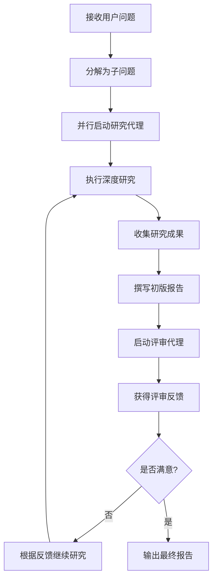

# Deep Research Agent

基于 Spring AI Alibaba Agent Framework 的高级研究代理系统，具备复杂的多代理协作和 MCP 集成能力。

## 📋 项目概述

Deep Research Agent 是一个专业级的 AI 研究助手，能够：
- 进行深度学术研究
- 并行处理多个研究子任务
- 自动生成高质量研究报告
- 通过多轮迭代改进研究质量
- 集成外部工具和服务

## 🏗️ 核心架构

### 多代理系统设计

```
主代理 (DeepResearchAgent)
├── 研究子代理 (research-agent)
│   └── 专注特定研究主题的深度挖掘
├── 评审子代理 (critique-agent)
│   └── 负责报告质量和准确性审查
└── MCP 工具集成
    ├── ArXiv 论文检索
    └── Jina Web 搜索
```

### 关键组件

1. **主研究代理**：协调整个研究流程
2. **拦截器系统**：处理各种运行时需求
3. **钩子机制**：提供精细控制点
4. **MCP 客户端**：集成外部工具能力

## 🚀 快速开始

### 1. 环境准备

```bash
# 必需依赖
JDK 21+
Maven 3.8+
阿里云百炼 API Key

# 可选依赖
uv (用于 ArXiv MCP Server)
Node.js + npm (用于 Jina MCP Tools)
```

### 2. 环境变量配置

```bash
# 阿里云百炼 API 密钥（必需）
export AI_DASHSCOPE_API_KEY=your_dashscope_api_key_here

# Jina API 密钥（可选，已在配置文件中）
export JINA_API_KEY=your_jina_api_key_here
```

Windows PowerShell:
```powershell
$env:AI_DASHSCOPE_API_KEY="your_dashscope_api_key_here"
```

### 3. 启动应用

```bash
mvn spring-boot:run
```

访问聊天界面：`http://localhost:8080/chatui/index.html`

## 🔧 核心功能详解

### 1. 智能拦截器系统

#### LargeResultEvictionInterceptor
```java
/**
 * 大结果驱逐拦截器
 * 功能：当工具返回结果过大时自动保存到文件系统
 */
LargeResultEvictionInterceptor.builder()
    .excludeFilesystemTools()           // 排除文件系统工具，防止递归
    .toolTokenLimitBeforeEvict(5000)    // 5000 tokens 阈值
    .build();
```

#### FilesystemInterceptor
```java
/**
 * 文件系统拦截器
 * 功能：控制对文件系统的读写权限
 */
FilesystemInterceptor.builder()
    .readOnly(false)  // 允许读写操作
    .build();
```

#### TodoListInterceptor
```java
/**
 * 待办事项列表拦截器
 * 功能：管理和跟踪研究任务进度
 */
TodoListInterceptor.builder().build();
```

#### ContextEditingInterceptor
```java
/**
 * 上下文编辑拦截器
 * 功能：自动清理和压缩过长的上下文
 */
ContextEditingInterceptor.builder()
    .trigger(10000)         // 10000 tokens 触发阈值
    .clearAtLeast(6000)     // 至少清理 6000 tokens
    .keep(4)                // 保留最近 4 条消息
    .excludeTools("write_todos")  // 排除特定工具
    .build();
```

#### ToolRetryInterceptor
```java
/**
 * 工具重试拦截器
 * 功能：处理工具调用失败的重试逻辑
 */
ToolRetryInterceptor.builder()
    .maxRetries(1)  // 最多重试 1 次
    .onFailure(RETURN_MESSAGE)  // 失败时返回错误消息
    .build();
```

### 2. 钩子机制

#### SummarizationHook
```java
/**
 * 摘要钩子
 * 功能：当对话历史过长时自动生成摘要
 */
SummarizationHook.builder()
    .model(chatModel)                   // 使用的模型
    .maxTokensBeforeSummary(120000)     // 12万 tokens 触发摘要
    .messagesToKeep(6)                  // 保留最近 6 条消息
    .build();
```

#### HumanInTheLoopHook
```java
/**
 * 人类参与钩子
 * 功能：在关键操作前请求人类审批
 */
HumanInTheLoopHook.builder()
    .approvalOn("jina_search", "请批准 jina_search 工具的使用")
    .approvalOn("download_paper", "请批准下载论文")
    .build();
```

#### ToolCallLimitHook
```java
/**
 * 工具调用限制钩子
 * 功能：防止单次运行中工具调用次数过多
 */
ToolCallLimitHook.builder()
    .runLimit(25)  // 单次运行限制 25 次工具调用
    .build();
```

### 3. 子代理系统

#### 研究子代理 (research-agent)
```java
SubAgentSpec researchAgent = SubAgentSpec.builder()
    .name("research-agent")
    .description("用于深入研究特定问题，一次只处理一个主题")
    .systemPrompt(subResearchPrompt)
    .tools(toolsFromMcp)
    .enableLoopingLog(true)
    .build();
```

#### 评审子代理 (critique-agent)
```java
SubAgentSpec critiqueAgent = SubAgentSpec.builder()
    .name("critique-agent")
    .description("用于评审最终报告的质量和准确性")
    .systemPrompt(subCritiquePrompt)
    .enableLoopingLog(true)
    .build();
```

## 📊 工作流程

### 研究流程图



### 典型使用场景

1. **学术研究**：深入探讨复杂学术话题
2. **技术调研**：分析新兴技术趋势
3. **市场分析**：综合多方信息形成洞察
4. **问题诊断**：系统性分析和解决复杂问题

## 🛠️ MCP 工具集成

### ArXiv 论文检索

配置文件：`mcp-servers-config.json`
```json
{
  "arxiv-mcp-server": {
    "command": "uv",
    "args": ["tool", "run", "arxiv-mcp-server", "--storage-path", "./papers-storage"]
  }
}
```

功能：
- 搜索学术论文
- 下载和存储论文
- 提取论文关键信息

### Jina Web 搜索

```json
{
  "jina-mcp-tools": {
    "command": "npx.cmd",
    "args": ["jina-mcp-tools", "--transport", "stdio", "--tokens-per-page", "15000"],
    "env": {
      "JINA_API_KEY": "your_api_key"
    }
  }
}
```

功能：
- 网页内容提取
- 搜索引擎集成
- 结构化数据获取

## 📚 系统提示词设计

### 主代理提示词
```markdown
你是专家研究员，工作是进行彻底研究并撰写精美的报告。

工作流程：
1. 首先将原始用户问题写入 question.txt 作为参考
2. 使用研究代理对子主题进行深度研究
3. 当收集足够信息后，将最终报告写入 final_report.md
4. 调用评审代理获取报告反馈
5. 迭代：根据评审进行更多研究并编辑报告
6. 重复步骤4-5直到对质量满意

报告格式要求：
- 使用与用户问题相同的语言！
- 使用清晰的 Markdown 结构
- 包含具体事实和研究见解
- 使用 [标题](URL) 格式引用来源
```

### 研究代理提示词
```markdown
你是专职研究员，工作是根据用户问题进行研究。

进行彻底研究然后回复用户详细的答案。

重要：只有你的最终答案会传递给用户，所以最终报告应该是全面且自包含的！
```

### 评审代理提示词
```markdown
你是专职编辑，任务是评审报告。

检查报告结构、内容完整性、语言表达等方面，并提供详细的改进建议。
```

## 🔧 配置说明

### application.yaml

```yaml
spring:
  application:
    name: DeepResearch
  
  ai:
    dashscope:
      api-key: ${AI_DASHSCOPE_API_KEY}
    
    mcp:
      client:
        enabled: true
        toolcallback:
          enabled: true
        stdio:
          servers-configuration: classpath:/mcp-servers-config.json
        request-timeout: 60000

server:
  port: 8080
```

### MCP 服务器配置

`mcp-servers-config.json` 定义了可用的 MCP 服务器及其配置。

## 🧪 使用示例

### 1. 基础研究查询

```
用户：请帮我研究人工智能在医疗领域的应用现状

代理将：
1. 分解为多个子问题（诊断、治疗、药物发现等）
2. 并行启动研究代理
3. 整合各领域研究成果
4. 生成综合性报告
```

### 2. 技术对比分析

```
用户：比较 Transformer 和 RNN 在自然语言处理中的优劣

代理将：
1. 分别研究两种架构
2. 对比性能指标
3. 分析适用场景
4. 提供详细的技术分析
```

## 📈 性能优化

### 1. 并行处理优化

```java
// 启用并行节点执行
.executor(Executors.newFixedThreadPool(10))
```

### 2. 内存管理

```java
// 配置合适的状态保存策略
.saver(new MemorySaver())
```

### 3. 超时控制

```yaml
# MCP 请求超时配置
request-timeout: 60000  # 60秒
```

## 🔒 安全考虑

### 1. 文件系统访问控制

```java
// 限制文件系统操作范围
FilesystemInterceptor.builder()
    .allowedPaths(Arrays.asList("./research-output/", "./temp/"))
    .build();
```

### 2. 工具调用限制

```java
// 限制危险工具的使用
HumanInTheLoopHook.builder()
    .approvalOn("shell_command", "需要批准执行 shell 命令")
    .build();
```

## 🤝 开发指南

### 添加新的子代理

```java
SubAgentSpec customAgent = SubAgentSpec.builder()
    .name("custom-agent")
    .description("自定义代理描述")
    .systemPrompt(customPrompt)
    .tools(customTools)
    .build();

subAgentBuilder.addSubAgent(customAgent);
```

### 扩展拦截器功能

```java
public class CustomInterceptor implements Interceptor {
    @Override
    public OverAllState intercept(InterceptorChain chain, OverAllState state) {
        // 自定义处理逻辑
        return chain.proceed(state);
    }
}
```

## 📊 监控和日志

### 启用详细日志

```java
.enableLogging(true)
.enableLoopingLog(true)  // 启用循环日志
```

### 状态监控

通过 `MemorySaver` 或自定义 saver 监控代理状态变化。

## 🐛 故障排除

### 常见问题

1. **MCP 服务器连接失败**
   - 检查 uv 和 npx 是否正确安装
   - 验证 API 密钥是否有效

2. **工具调用超时**
   - 调整 `request-timeout` 配置
   - 检查网络连接

3. **内存不足**
   - 启用上下文编辑拦截器
   - 减少并行代理数量

## 📄 许可证

MIT License

---
*Built with Spring AI Alibaba Agent Framework*