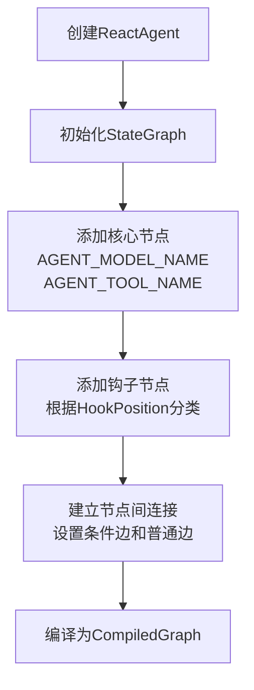
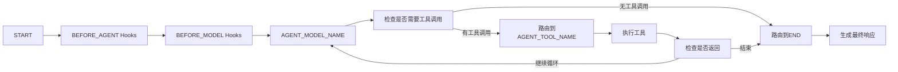

# ReactAgent中Graph工作流程详解

## 概述

ReactAgent是基于状态图（StateGraph）实现的智能代理系统，它使用ReAct（Reasoning and Acting）范式来处理任务。该系统通过状态图管理对话流程、工具调用和决策逻辑。

## 核心组件

### 1. StateGraph
- **作用**：定义整个代理的执行流程
- **节点**：代表不同的处理步骤（如模型推理、工具调用、钩子函数等）
- **边**：定义节点间的流转规则

### 2. CompiledGraph
- **作用**：将StateGraph编译为可执行的图结构
- **功能**：
  - 验证图结构的有效性
  - 注册所有节点和边
  - 处理并行节点和条件边
  - 提供执行接口

### 3. OverAllState
- **作用**：维护整个代理执行过程中的状态
- **数据存储**：
  - 对话消息历史
  - 工具调用结果
  - 用户输入
  - 内部状态变量
- **更新策略**：通过KeyStrategy控制不同键值的更新方式

### 4. RunnableConfig
- **作用**：提供运行时配置参数
- **包含内容**：
  - 线程ID（用于区分不同会话）
  - 检查点ID（用于恢复执行）
  - 下一节点信息
  - 流模式设置

## 工作流程详解

### 1. 初始化阶段



在初始化阶段，ReactAgent会：

1. 创建StateGraph实例
2. 添加主要处理节点：
   - [AGENT_MODEL_NAME](file:///C:/Users/PC/.m2/repository/com/alibaba/cloud/ai/spring-ai-alibaba-agent-framework/1.1.0.0/spring-ai-alibaba-agent-framework-1.1.0.0-sources.jar!/com/alibaba/cloud/ai/graph/agent/ReactAgent.java#L44-L44)：负责LLM推理
   - [AGENT_TOOL_NAME](file:///C:/Users/PC/.m2/repository/com/alibaba/cloud/ai/spring-ai-alibaba-agent-framework/1.1.0.0/spring-ai-alibaba-agent-framework-1.1.0.0-sources.jar!/com/alibaba/cloud/ai/graph/agent/ReactAgent.java#L44-L44)：负责工具调用
3. 添加各类钩子节点：
   - [BEFORE_AGENT](file:///C:/Users/PC/.m2/repository/com/alibaba/cloud/ai/spring-ai-alibaba-agent-framework/1.1.0.0/spring-ai-alibaba-agent-framework-1.1.0.0-sources.jar!/com/alibaba/cloud/ai/graph/agent/hook/HookPosition.java#L21-L21)：代理执行前
   - [AFTER_AGENT](file:///C:/Users/PC/.m2/repository/com/alibaba/cloud/ai/spring-ai-alibaba-agent-framework/1.1.0.0/spring-ai-alibaba-agent-framework-1.1.0.0-sources.jar!/com/alibaba/cloud/ai/graph/agent/hook/HookPosition.java#L22-L22)：代理执行后
   - [BEFORE_MODEL](file:///C:/Users/PC/.m2/repository/com/alibaba/cloud/ai/spring-ai-alibaba-agent-framework/1.1.0.0/spring-ai-alibaba-agent-framework-1.1.0.0-sources.jar!/com/alibaba/cloud/ai/graph/agent/hook/HookPosition.java#L23-L23)：模型调用前
   - [AFTER_MODEL](file:///C:/Users/PC/.m2/repository/com/alibaba/cloud/ai/spring-ai-alibaba-agent-framework/1.1.0.0/spring-ai-alibaba-agent-framework-1.1.0.0-sources.jar!/com/alibaba/cloud/ai/graph/agent/hook/HookPosition.java#L24-L24)：模型调用后
4. 编译图结构为[CompiledGraph](file:///C:/Users/PC/.m2/repository/com/alibaba/cloud/ai/spring-ai-alibaba-graph-core/1.1.0.0/spring-ai-alibaba-graph-core-1.1.0.0-sources.jar!/com/alibaba/cloud/ai/graph/CompiledGraph.java#L73-L73)

### 2. 执行阶段

#### 2.1 输入处理
- 将用户输入转换为状态数据
- 初始化[OverAllState](file:///C:/Users/PC/.m2/repository/com/alibaba/cloud/ai/spring-ai-alibaba-graph-core/1.1.0.0/spring-ai-alibaba-graph-core-1.1.0.0-sources.jar!/com/alibaba/cloud/ai/graph/OverAllState.java#L53-L53)对象
- 设置初始配置[RunnableConfig](file:///C:/Users/PC/.m2/repository/com/alibaba/cloud/ai/spring-ai-alibaba-graph-core/1.1.0.0/spring-ai-alibaba-graph-core-1.1.0.0-sources.jar!/com/alibaba/cloud/ai/graph/RunnableConfig.java#L35-L35)

#### 2.2 图遍历执行


执行流程包括：

1. **起始节点**：从[START](file:///C:/Users/PC/.m2/repository/com/alibaba/cloud/ai/spring-ai-alibaba-graph-core/1.1.0.0/spring-ai-alibaba-graph-core-1.1.0.0-sources.jar!/com/alibaba/cloud/ai/graph/StateGraph.java#L44-L44)开始执行
2. **前置处理**：执行[BEFORE_AGENT](file:///C:/Users/PC/.m2/repository/com/alibaba/cloud/ai/spring-ai-alibaba-agent-framework/1.1.0.0/spring-ai-alibaba-agent-framework-1.1.0.0-sources.jar!/com/alibaba/cloud/ai/graph/agent/hook/HookPosition.java#L21-L21)和[BEFORE_MODEL](file:///C:/Users/PC/.m2/repository/com/alibaba/cloud/ai/spring-ai-alibaba-agent-framework/1.1.0.0/spring-ai-alibaba-agent-framework-1.1.0.0-sources.jar!/com/alibaba/cloud/ai/graph/agent/hook/HookPosition.java#L23-L23)钩子
3. **模型推理**：在[AGENT_MODEL_NAME](file:///C:/Users/PC/.m2/repository/com/alibaba/cloud/ai/spring-ai-alibaba-agent-framework/1.1.0.0/spring-ai-alibaba-agent-framework-1.1.0.0-sources.jar!/com/alibaba/cloud/ai/graph/agent/ReactAgent.java#L44-L44)节点执行LLM推理
4. **决策分支**：根据模型输出判断是否需要工具调用
5. **工具执行**：如果需要工具调用，则跳转到[AGENT_TOOL_NAME](file:///C:/Users/PC/.m2/repository/com/alibaba/cloud/ai/spring-ai-alibaba-agent-framework/1.1.0.0/spring-ai-alibaba-agent-framework-1.1.0.0-sources.jar!/com/alibaba/cloud/ai/graph/agent/ReactAgent.java#L44-L44)节点
6. **循环或结束**：工具执行后决定是返回模型还是结束

### 3. 条件边处理

ReactAgent使用条件边来实现复杂的决策逻辑：

#### 3.1 模型到工具的路由
```java
EdgeAction modelToTools = state -> {
    List<Message> messages = (List<Message>) state.value("messages").orElse(List.of());
    Message lastMessage = messages.get(messages.size() - 1);
    
    if (lastMessage instanceof AssistantMessage assistantMessage) {
        if (assistantMessage.hasToolCalls()) {
            return AGENT_TOOL_NAME;  // 需要工具调用
        } else {
            return END;             // 直接结束
        }
    }
    // ... 其他情况处理
};
```

#### 3.2 工具到模型的路由
```java
EdgeAction toolsToModel = state -> {
    // 检查工具执行结果
    // 决定是否返回模型继续推理
    return modelDestination;  // 返回模型
};
```

## 状态管理机制

### 1. 状态序列化
- 使用[StateSerializer](file:///C:/Users/PC/.m2/repository/com/alibaba/cloud/ai/spring-ai-alibaba-graph-core/1.1.0.0/spring-ai-alibaba-graph-core-1.1.0.0-sources.jar!/com/alibaba/cloud/ai/graph/serializer/StateSerializer.java#L26-L26)进行状态的序列化和反序列化
- 默认使用[SpringAIJacksonStateSerializer](file:///C:/Users/PC/.m2/repository/com/alibaba/cloud/ai/spring-ai-alibaba-graph-core/1.1.0.0/spring-ai-alibaba-graph-core-1.1.0.0-sources.jar!/com/alibaba/cloud/ai/graph/serializer/plain_text/jackson/SpringAIJacksonStateSerializer.java#L28-L28)

### 2. 检查点机制
- 使用[Checkpoint](file:///C:/Users/PC/.m2/repository/com/alibaba/cloud/ai/spring-ai-alibaba-graph-core/1.1.0.0/spring-ai-alibaba-graph-core-1.1.0.0-sources.jar!/com/alibaba/cloud/ai/graph/checkpoint/Checkpoint.java#L29-L29)保存执行状态
- 支持中断和恢复执行
- 通过[BaseCheckpointSaver](file:///C:/Users/PC/.m2/repository/com/alibaba/cloud/ai/spring-ai-alibaba-graph-core/1.1.0.0/spring-ai-alibaba-graph-core-1.1.0.0-sources.jar!/com/alibaba/cloud/ai/graph/checkpoint/BaseCheckpointSaver.java#L20-L20)实现持久化

### 3. 状态快照
- 通过[StateSnapshot](file:///C:/Users/PC/.m2/repository/com/alibaba/cloud/ai/spring-ai-alibaba-graph-core/1.1.0.0/spring-ai-alibaba-graph-core-1.1.0.0-sources.jar!/com/alibaba/cloud/ai/graph/state/StateSnapshot.java#L26-L26)提供执行过程中的状态快照
- 用于调试和监控

## 钩子机制

ReactAgent提供了丰富的钩子机制：

### 1. Agent钩子
- 实现[AgentHook](file:///C:/Users/PC/.m2/repository/com/alibaba/cloud/ai/spring-ai-alibaba-agent-framework/1.1.0.0/spring-ai-alibaba-agent-framework-1.1.0.0-sources.jar!/com/alibaba/cloud/ai/graph/agent/hook/AgentHook.java#L17-L17)接口
- 在代理执行前后插入自定义逻辑

### 2. 模型钩子
- 实现[ModelHook](file:///C:/Users/PC/.m2/repository/com/alibaba/cloud/ai/spring-ai-alibaba-agent-framework/1.1.0.0/spring-ai-alibaba-agent-framework-1.1.0.0-sources.jar!/com/alibaba/cloud/ai/graph/agent/hook/ModelHook.java#L17-L17)接口
- 在模型调用前后插入自定义逻辑

### 3. 人类介入钩子
- [HumanInTheLoopHook](file:///C:/Users/PC/.m2/repository/com/alibaba/cloud/ai/spring-ai-alibaba-agent-framework/1.1.0.0/spring-ai-alibaba-agent-framework-1.1.0.0-sources.jar!/com/alibaba/cloud/ai/graph/agent/hook/hip/HumanInTheLoopHook.java#L21-L21)允许在执行过程中暂停并等待人工反馈

## 并行处理

ReactAgent支持并行节点执行：
- 通过[ParallelNode](file:///C:/Users/PC/.m2/repository/com/alibaba/cloud/ai/spring-ai-alibaba-graph-core/1.1.0.0/spring-ai-alibaba-graph-core-1.1.0.0-sources.jar!/com/alibaba/cloud/ai/graph/internal/node/ParallelNode.java#L35-L35)实现
- 可以为不同并行节点指定不同的执行器
- 支持配置默认并行执行器

## 总结

ReactAgent的Graph工作流程是一个高度模块化和可扩展的设计：

1. **声明式图定义**：通过节点和边定义执行流程
2. **状态驱动**：所有操作都基于当前状态进行
3. **灵活的路由**：通过条件边实现复杂决策逻辑
4. **丰富的钩子**：允许在关键位置插入自定义逻辑
5. **可靠的持久化**：支持检查点和恢复机制
6. **并发安全**：支持多线程环境下的执行

这种设计使得ReactAgent能够处理复杂的AI代理任务，同时保持代码的清晰性和可维护性。